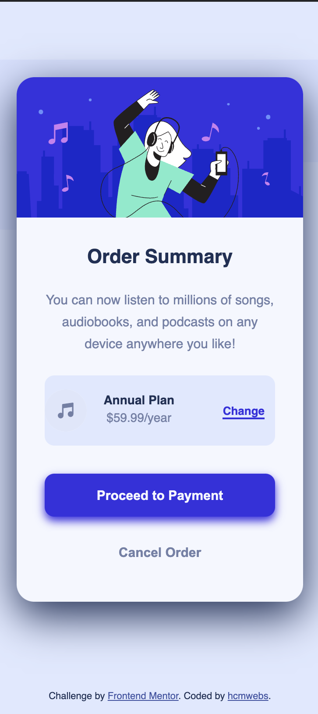

# Frontend Mentor - Order summary card solution

This is a solution to the [Order summary card challenge on Frontend Mentor](https://www.frontendmentor.io/challenges/order-summary-component-QlPmajDUj). Frontend Mentor challenges help you improve your coding skills by building realistic projects.

## Table of contents

- [Overview](#overview)
  - [The challenge](#the-challenge)
  - [Screenshot](#screenshot)
  - [Links](#links)
- [My process](#my-process)
  - [Built with](#built-with)
  - [What I learned](#what-i-learned)
  - [Continued development](#continued-development)
  - [Useful resources](#useful-resources)
- [Author](#author)
- [Acknowledgments](#acknowledgments)

**Note: Delete this note and update the table of contents based on what sections you keep.**

## Overview

### The challenge

Users should be able to:

- See hover states for interactive elements

### Screenshots

### Links

- Solution URL: [Order summary component with just html and css](https://www.frontendmentor.io/solutions/responsive-order-summary-component-with-just-html-and-css-zQRYKEn_H)
- Live Site URL: [Deployed site on vercel](https://order-lkik0vutu-hcmwebs.vercel.app/)

## My process

### Built with

- Semantic HTML5 markup
- CSS custom properties
- Flex-box
- CSS Grid
- Mobile-first workflow

### What I learned

- I added more information about working with SVGs.

### Continued development

- I still have issues with positioning the background images but quite happy with the evolution.

### Useful resources

- [StackOverflow](https://stackoverflow.com/) - There is one of my favourite resource. Any question that I may have, there is another person who had struggled with it, highest probability if not always, I find it here. Plus there is more than one person who have tried to answer to that question. Hence I get more answers than I bargained for.
- [Google](https://www.google.com) - I am a big user of this resource and I am not ashamed to admit it.

## Author

- Website - [hcmwebs](https://www.hcmwebs.com)
- Frontend Mentor - [@hcmwebs](https://www.frontendmentor.io/profile/hcmwebs)
- Twitter - [@hcmwebs](https://www.twitter.com/hcmwebs)

## Acknowledgments

[Frontend Mentor](http://www.frontendmentor.io/) - My sincere gratitude to you and to your entire team for tirelessly adding projects after projects every week. The challenges are very much fun and I learn a lot from each one them. Thank you very much .
